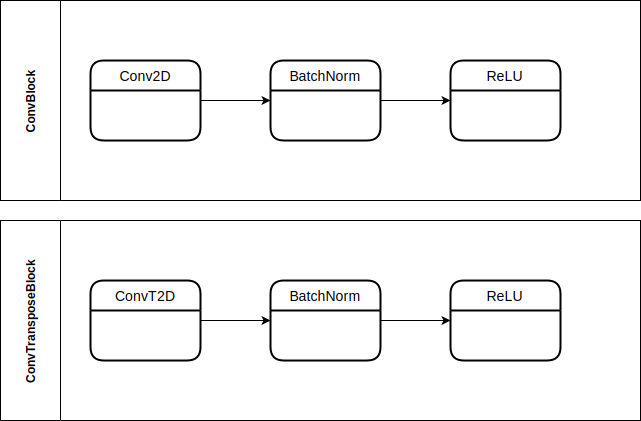
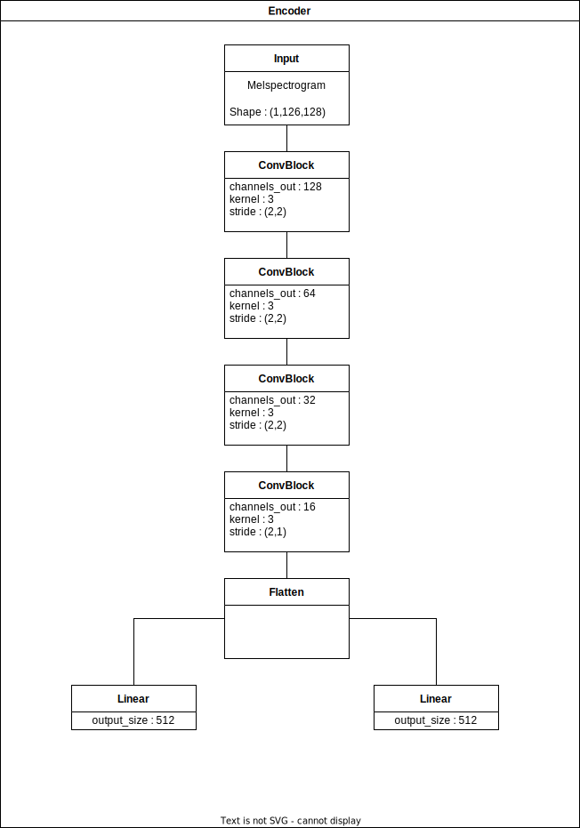
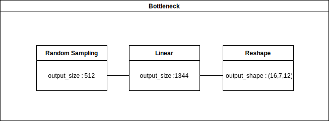
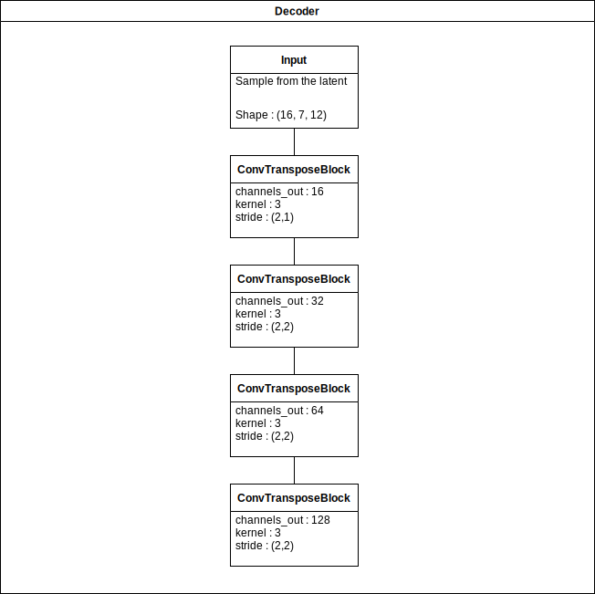

# Effect Modelling

### Dataset 

* Subset generator || vae_nsynth/utils_scripts/subset.ipynb
* Distorted generator (Pedalboard/Crave) || vae_nsynth/utils_scirpts/data_construct.ipynb
* NSynth Dataset Pytorch class || vae_nsynth/dataset/nsynth.py

### Training 

* train.py : launch train, save each epoch, grid-search.
* resume_train.py : resume train from saved model.
* test model and compare melspectrograms : vae_nsynth/utils_scripts/test_inference.ipynb

### Model

* Convolutional models in vae_nsynth/model/

